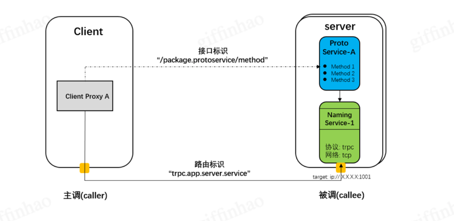
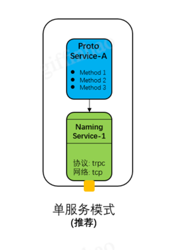
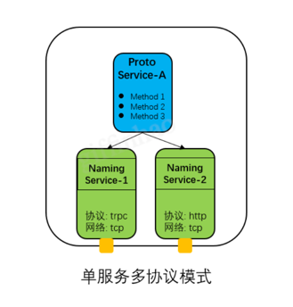
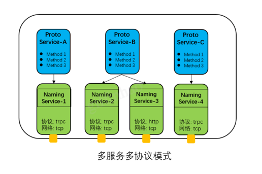
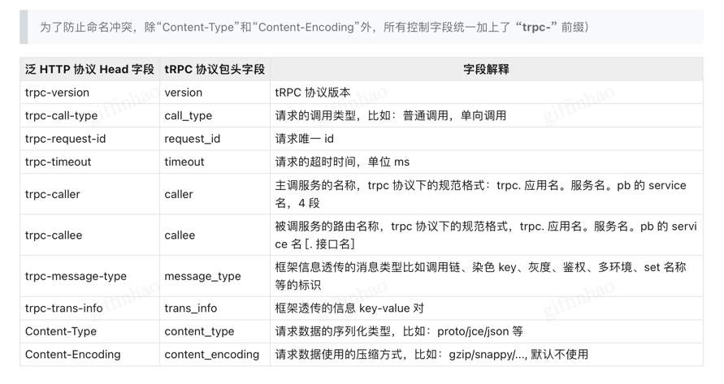
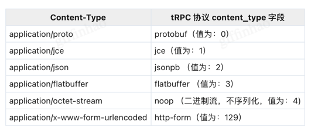
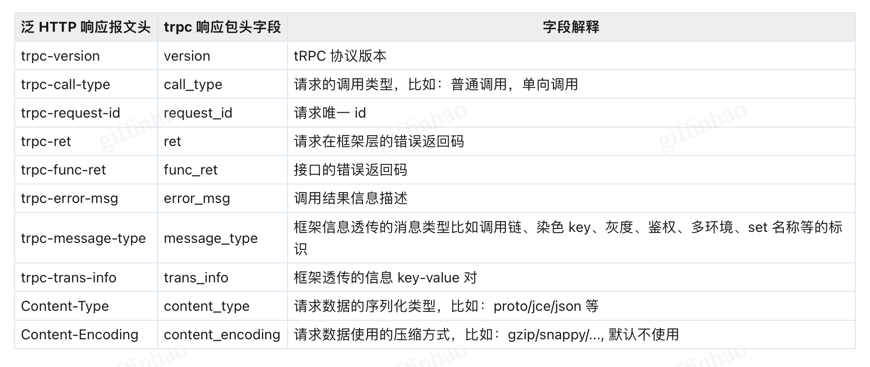

# 项目

## BatchAddVisualEvent

### buriedpoint_visual_service.go

从服务寻址的角度来看, 服务需要一个标识, 通过查询此标识就能获取服务的地址,也就是IP+端口+协议. 路由标识一般通过名字服务进行管理，标识必须全局唯一, 我们也把它称为 服务名 或 Naming Service。客户端通过路由标识向名字服务查询获取服务的地址

proto service负责定义RPC的接口的定义和归类， naming service负责网络通信连接的建立，协议的处理，它们是两个独立的概念。 我们需要把两者关联起来，通过把proto service注册到naming service来完成服务的组装。
基于微服务的“单一职责”原则， tRPC建议一个服务端程序只提供一个proto service，对应一个naming service， 通过一个端口对外提供接口服务。服务组装模式如图所示:

对于个别场景，业务需要对一个服务通过多种协议提供服务，例如: 一个认证服务需要通过http协议对外部系统提供认证服务，同时也需要通过tRPC协议对内部其它应用程序提供认证服务。
对于这种场景，tRPC提供了单服务多协议的服务组装模式, 具体如图所示

系统同时也支持多服务模型， 即一个server有多个proto service，每个proto service对应一个或者多个naming service，多个proto service之间不共享naming service。对于这种模型的使用，
开发人员可能审视微服务的设计是否可以合理，是否需要做拆分，以满足“单一职责”原则。服务组合模式如图所示

#### service 介绍
    服务代码层、协议层，服务入口，对外暴露的 rpc 接口处，接口表现层。
    服务入口应与程序入口一样，越简单直观越好，直入主题，可与 main.go 同级，放在 server 根目录上。
    一个 server 可以有多个 service，一个 service 一个文件，多个 rpc 方法在同一个 service 里面，
    类似一个类一个文件。
    service 的 rpc 方法应尽量小，40 行以内，service 尽可能轻量，将复杂业务逻辑下沉到 logic 层。
    service 只是一个服务入口的概念层，可以不需要单独的目录，server 根目录即为 service 层，
    对于复杂的 service 服务也可考虑单独的 service 目录。
#### basehandler.go
    定义了一组需要由具体处理程序实现的基础方法：
    CheckParam：参数校验方法，用于检查请求参数是否符合预期。
    CheckAuth：权限校验方法，确保调用者有权执行请求的操作。
    DoBusiness：核心业务逻辑方法，执行具体的业务处理。
    AssembleResponse：封装返回数据的方法，用于准备发送给客户端的响应数据。

#### repo
    外部依赖层，数据资源库，包括后端 rpc 调用和 db 操作以及任何其他网络依赖，一切网络依赖本质上都是为了读写数据资源。
    所有的外部网络依赖抽象到 repository 这一层，这里需要屏蔽外部服务实现细节，将下游数据结构转成当前服务需要的结构，这里是操作 db 或者 rpc 的原子接口，尽量不要有业务逻辑，所以 repository 
    【这里的 API 接口定义的输入输出参数应该是当前服务的结构体，而不是第三方服务的结构体】。
    只能上层依赖下层，并且只能依赖抽象不可依赖实现，保证下层内部具体实现逻辑变动不影响上层，如 repo 这里从 mysql 切换到 redis，对 logic 层应当是无感知的，repo 可自由、独立的选择并切换任何持久化存储，所以定义 repo 层 API 时，尽量使用通用的词，如 GetXxx SetXxx，
    不要定义 Select Query 等跟具体存储行为强绑定的词。
    repo 里面的存储操作必须是隔离的，统一使用 rpc 接口对外暴露存储行为，不可为了复用将存储操作 API 直接暴露给其他 server， 更不可直接将 mysql 等 db 的账号密码以及执行语句暴露出去。
    为什么要把 rpc 和 db 归为同一类呢？云原生十二要素“backing services”指出：要把所有通过网络调用的各种后端服务当做附加资源，包括数据库，消息队列，邮件，缓存等等，
    我们不应区分本地服务还是第三方服务，rpc 服务还是 db 服务，统一以附加资源服务对待，另外 trpc-go 的 database 仓库 已经把所有的存储 API 全部封装成了 trpc-go rpc client 模式，对开发者来说，存储和 rpc 已经没有任何区别了。

#### handler
    服务具体业务逻辑层，这里经过复杂的业务逻辑操作后将数据吐给 service 层，service 层再吐给调用方。
    logic 包名无意义，应继续按功能细分子目录，注意这里是按业务逻辑功能拆分，不是按 rpc 方法拆分。
    这里是服务内部纯粹的业务逻辑，跟上层 service 解耦，与 rpc 方法等下层依赖无关，因为 service 层有可能会随时增减多个 service 或者 timer，
    这里是共享的业务逻辑原子接口供 service 层组合复用，被依赖的下层函数参数应尽量精简，不要一个大结构体传来传去，应充分利用 golang 的多返回值特性，返回子结构供 service 拼装数据。这样也相当于业务逻辑与框架解耦，不依赖于任何一个特定的 server 框架。
    大部分业务代码都应该在 logic 这一层，参数校验，各种转化，并发组合，异步任务等都属于业务逻辑。
    假如该服务逻辑非常简单，如整个 server 就只是调一个 rpc，初期可不需要 logic 层，service 直接依赖 repository，或者只有 service 这一层，
    但随着时间的推移，逻辑越来越多，如增加了另一个 service 或者方法/文件过大，此时则应该开始考虑重构，划分 logic 层，并把业务逻辑抽离到 logic 里面。

### Naming servcie
    在这个示例中，服务的路由标识是“trpc.test.helloworld.Greeter1”，协议类型为“trpc”，
    地址为“127.0.0.1:8000”。程序在启动时会自动读取这个配置，并生成 Naming Service。如果服务端选择了“服务注册”插件，则应用程序会自动注册 Naming Service 的“name”和“ipport”等信息到名字服务，这样客户端就可以使用这个名字进行寻址了

## 定义 Proto Service
    Proto Service 是一组接口的逻辑组合，它需要定义 package，proto service，rpc name 以及接口请求和响应的数据类型。同时还需要把 Proto Service 和 Naming Service 进行组合，完成服务的组装。关于 Proto Service 与 Naming Service 之间的关系请参考 tRPC 术语介绍。对于服务的组装，
    虽然“IDL 协议类型”和“非 IDL 协议类型”提供给开发者的注册接口略有区别，但框架内部对两者实现是一致的。
### 4.1 IDL 协议类型
IDL 语言可以通过一种中立的方式来描述接口，并使用工具把 IDL 文件转换成指定语言的桩代码，使程序员专注于业务逻辑开发。tRPC 服务，tRPC 流式服务和泛 HTTP RPC 服务都是 IDL 协议类型服务。
对于 IDL 协议类型的服务，Proto Service 的定义通常分为以下三步：
第一步：采用了 IDL 语言描述 RPC 接口规范，生成 IDL 文件。以 tRPC 服务为例，其 IDL 文件的定义如下：

        syntax = "proto3";
        package trpc.test.helloworld;
        option go_package="git.code.oa.com/trpcprotocol/test/helloworld";
        
        service Greeter {
        rpc SayHello (HelloRequest) returns (HelloReply) {}
        }
        
        message HelloRequest {
        string msg = 1;
        }
        
        message HelloReply {
        string msg = 1;
        }
第二步：通过开发工具可以生成对应服务端和客户端的桩代码

    trpc create --protofile=helloworld.proto
第三步：就把 Proto Service 注册到 Naming Service 上，完成服务的组装。

    type greeterServerImpl struct{}
    // 接口处理函数
    func (s *greeterServerImpl) SayHello(ctx context.Context, req *pb.HelloRequest, rsp *pb.HelloReply) error {
    rsp.Msg = "Hello, I am tRPC-Go server."
    return nil
    }
    
    func main() {
    // 通过读取框架配置中的 server.service 配置项，创建 Naming Service
    s := trpc.NewServer()
    // 注册 Proto Service 的实现实例到 Naming Service 中
    pb.RegisterGreeterService(s, &greeterServerImpl{})
    ...
    }

## 4.2 非 IDL 协议类型

## 4.3 多服务注册
对于程序不是单服务模式时（只有一个 naming service 和一个 proto service），用户需要明确指定 naming service 和 proto service 的映射关系。
关于两者映射关系的介绍请参考 tRPC 术语介绍 章节。
对于多服务的注册，我们以 tRPC 服务为例定义两个 Proto Service：trpc.test.helloworld.Greeter 和 trpc.test.helloworld.Hello

    syntax = "proto3";
    package trpc.test.helloworld;
    option go_package="git.code.oa.com/trpcprotocol/test/helloworld";
    service Greeter {
    rpc SayHello (HelloRequest) returns (HelloReply) {}
    }
    
    service Hello {
    rpc SayHi (HelloRequest) returns (HelloReply) {}
    }
    
    message HelloRequest {
    string msg = 1;
    }
    message HelloReply {
    string msg = 1;
    }
与之对应也需要定义两个 Naming Service：trpc.test.helloworld.Greeter 和 trpc.test.helloworld.Hello：

    server:                                            #服务端配置
    service:                                         #业务服务提供的 service，可以有多个
    - name: trpc.test.helloworld.Greeter           #service 的路由名称，这里是一个数组，注意：name 前面的减号
    ip: 127.0.0.1                                #服务监听 ip 地址，ip 和 nic 二选一，优先 ip
    port: 8000                                   #服务监听端口
    network: tcp                                 #网络监听类型  tcp udp unix
    protocol: trpc                               #应用层协议 trpc http
    timeout: 1000                                #请求最长处理时间 单位 毫秒
      - name: trpc.test.helloworld.Hello             #service 的路由名称，这里是一个数组，注意：name 前面的减号
      ip: 127.0.0.1                                #服务监听 ip 地址，ip 和 nic 二选一，优先 ip
      port: 8001                                   #服务监听端口
      network: tcp                                 #网络监听类型  tcp udp unix
      protocol: trpc                               #应用层协议 trpc http
      transport: tnet                 # 要求框架版本 >= 0.11.0，为 tcp trpc 启用 tnet，其他协议可以自行验证
      timeout: 1000                                #请求最长处理时间 单位 毫秒
把 Proto Service 注册到 Naming Service，多服务场景需要指定 Naming Service 的名称

    func main() {
    // 通过读取框架配置中的 server.service 配置项，创建 Naming Service
    s := trpc.NewServer()
    // 注册 Greeter 服务
    pb.RegisterGreeterService(s.Service("trpc.test.helloworld.Greeter"), &greeterServerImpl{})
    // 注册 Hello 服务
    pb.RegisterHelloService(s.Service("trpc.test.helloworld.Hello"), &helloServerImpl{})
    ...
    }

# tRPC-Go搭建泛HTTP标准服务
对泛 HTTP 标准服务，tRPC-Go 框架在报文处理上只负责 HTTP 原始报文的接收和发送。HTTP 报文的序列化/反序列化，压缩/解压缩以及接口定义均需要业务按“net/http”提供的 API 自行实现。框架提供了 URL 注册模式 和 Mux 注册模式。
## URL 注册模式

## 3 服务定义
对于泛 HTTP 标准服务，我可以在“trpc_go.yaml”框架配置文件中通过“protocol”字段来指定具体协议类型。
### 3.1 作为 http 服务
我们可以通过设置“protocol”为“http_no_protocol”，即可启动一个无协议的 http 服务。

    ...
    server:                                            #服务端配置
    service:                                         #业务服务提供的 service，可以有多个
    - name: trpc.test.hello.stdhttp                #service 的路由名称
    ip: 127.0.0.1                                #服务监听 ip 地址 可使用占位符 ${ip},ip 和 nic 二选一，优先 ip
    port: 8000                                   #服务监听端口 可使用占位符 ${port}
    network: tcp                                 #网络监听类型  tcp udp
    protocol: http_no_protocol                               #应用层协议 trpc http
    timeout: 1000                                #请求最长处理时间 单位 毫秒
### 3.2 作为 https 服务
我们可以通过设置“protocol”为“http_no_protocol”, 并同时设置私钥“tls_key”和证书“tls_cert”，即可启动一个 https 服务。https 协议分为“单向认证”和“双向认证”两种。
单向认证：只有一方验证另一方是否合法，通常是客户端验证服务端，因此服务端配置只需要设置 tls_key、tls_cert 即可开启单向认证。一般面向公众的 HTTPS 网站都是单向认证。

    server:                                            #服务端配置
    service:                                         #业务服务提供的 service，可以有多个
    - name: trpc.test.hello.stdhttp                #service 的路由名称
    ip: 127.0.0.1                                #服务监听 ip 地址 可使用占位符 ${ip},ip 和 nic 二选一，优先 ip
    port: 8000                                   #服务监听端口 可使用占位符 ${port}
    network: tcp                                 #网络监听类型  tcp udp
    protocol: http_no_protocol                               #应用层协议 trpc http
    timeout: 1000                                #请求最长处理时间 单位 毫秒
    tls_key: ./license.key                       #私钥路径
    tls_cert: ./license.crt                      #证书路径

双向认证：服务端与客户端需要互相验证，在单向认证的基础上，增加 ca_cert 配置来验证客户端的合法性。一般银行等金融网站使用双向认证。

    server:                                            #服务端配置
    service:                                         #业务服务提供的 service，可以有多个
    - name: trpc.test.hello.stdhttp                #service 的路由名称
    ip: 127.0.0.1                                #服务监听 ip 地址 可使用占位符 ${ip},ip 和 nic 二选一，优先 ip
    port: 8000                                   #服务监听端口 可使用占位符 ${port}
    network: tcp                                 #网络监听类型  tcp udp
    protocol: http_no_protocol                               #应用层协议 trpc http
    timeout: 1000                                #请求最长处理时间 单位 毫秒
    tls_key: ./license.key                       #私钥路径
    tls_cert: ./license.crt                      #证书路径
    ca_cert: ca.cert                             #ca 证书，用于校验 client 证书，以更严格识别客户端的身份，限制客户端的访问
### 3.3 作为 http2 服务
因为 http2 协议需要在 https 协议的基础上使用，所以我们需要通过设置“protocol”为“http2_no_protocol”，并设置 tls 配置即可启动一个 http2 服务。http2 同样支持“单向认证”和“双向认证”两种方式，具体参考 https 的配置。

    server:                                            #服务端配置
    service:                                         #业务服务提供的 service，可以有多个
    - name: trpc.test.hello.stdhttp                #service 的路由名称
    ip: 127.0.0.1                                #服务监听 ip 地址 可使用占位符 ${ip},ip 和 nic 二选一，优先 ip
    port: 8000                                   #服务监听端口 可使用占位符 ${port}
    network: tcp                                 #网络监听类型 tcp udp
    protocol: http2_no_protocol                              #应用层协议
    timeout: 1000                                #请求最长处理时间 单位 毫秒
    tls_key: ./license.key                       #私钥路径
    tls_cert: ./license.crt                      #证书路径

# 4 代码示例
4.1 普通服务

本示例实现了一个“Hello World”的简单 Http 服务， 在示例中我们展示了 HTTP Head 的读写，Cookie 的设置以及如何设置 HTTP 状态码。

    package main
    
    import (
    "encoding/json"
    "io/ioutil"
    "net/http"
    
        "git.code.oa.com/trpc-go/trpc-go/log"
    
        trpc "git.code.oa.com/trpc-go/trpc-go"
        thttp "git.code.oa.com/trpc-go/trpc-go/http"
    )
    
    // Data 请求报文数据
    type Data struct {
    Msg string
    }
    
    func handle(w http.ResponseWriter, r *http.Request) error {
    // 获取请求报文头里的 "request" 字段
    reqHead := r.Header.Get("request")
    
        // 获取请求报文中的数据
        msg, _ := ioutil.ReadAll(r.Body)
        log.Infof("data is %s, request head is %s\n", msg, reqHead)
    
        // 为响应报文设置 Cookie
        cookie := &http.Cookie{Name: "sample", Value: "sample", HttpOnly: false}
        http.SetCookie(w, cookie)
        // 注意：使用 ResponseWriter 回包时，Set/WriteHeader/Write 这三个方法必须严格按照以下顺序调用
        w.Header().Set("Content-type", "application/json")
        // 为响应报文头添加 “reply” 字段
        w.Header().Add("reply", "tested")
    
        // 为响应报文设置 HTTP 状态码
        // w.WriteHeader(403)
    
        // 为响应报文设置 Body
        rsp, _ := json.Marshal(&Data{Msg: "Hello, World!"})
        w.Write(rsp)
    
        return nil
    }
    
    func main() {
    s := trpc.NewServer()
    // 路由注册
    thttp.HandleFunc("/v1/hello", handle)
    // 服务注册
    thttp.RegisterNoProtocolService(s.Service("trpc.test.hello.stdhttp"))
    s.Serve()
    }
框架配置文件 "trpc_go.yaml"配置为：

    global:                               #全局配置
    namespace: Development              #环境类型，分正式 production 和非正式 development 两种类型
    env_name: test                      #环境名称，非正式环境下多环境的名称
    
    server:                               #服务端配置
    app: test                           #业务的应用名
    server: stdhttp                     #进程服务名
    service:                            #业务服务提供的 service，可以有多个
    - name: trpc.test.hello.stdhttp  #service 的路由名称
    ip: 127.0.0.1                   #服务监听 ip 地址 可使用占位符 ${ip},ip 和 nic 二选一，优先 ip
    port: 8000                      #服务监听端口 可使用占位符 ${port}
    network: tcp                    #网络监听类型  tcp udp
    protocol: http_no_protocol                  #应用层协议 trpc http
    timeout: 1000                   #请求最长处理时间 单位 毫秒

4.3 协议代理
本节展示的示例是： 服务作为一个 Proxy，接收标准 HTTP 服务请求，然后转化成 tRPC 协议格式向后端的 tRPC 服务发送请求。 示例代码如下

    
    import (
    "context"
    "io/ioutil"
    "net/http"
    
        "git.code.oa.com/trpc-go/trpc-go/client"
        pb "git.code.oa.com/trpcprotocol/test/helloworld"
    
        trpc "git.code.oa.com/trpc-go/trpc-go"
        thttp "git.code.oa.com/trpc-go/trpc-go/http"
    )
    
    func handle(w http.ResponseWriter, r *http.Request) error {
    body, err := ioutil.ReadAll(r.Body)
    if err != nil {
    http.Error(w, "can't read body", http.StatusBadRequest)
    return nil
    }
    
        proxy := pb.NewGreeterClientProxy()
        req := &pb.HelloRequest{Msg: string(body[:])}
    
        // 向 tRPC 服务请求
        rsp, err := proxy.SayHello(context.Background(), req, client.WithTarget("ip://127.0.0.1:8001"))
        if err != nil {
            http.Error(w, "call fails！", http.StatusBadRequest)
            return nil
        }
    
        // 回响应给 HTTP 客户端
        w.Header().Set("Content-type", "application/text")
        w.Write([]byte(rsp.Msg))
    
        return nil
    }
    
    func main() {
    s := trpc.NewServer()
    // 路由注册
    thttp.HandleFunc("/v1/hello", handle)
    // 服务注册
    thttp.RegisterNoProtocolService(s.Service("trpc.test.hello.stdhttp"))
    s.Serve()
    }
框架配置文件 "trpc_go.yaml"配置为：

    global:                             #全局配置
    namespace: Development            #环境类型，分正式 production 和非正式 development 两种类型
    env_name: test                    #环境名称，非正式环境下多环境的名称
    
    server:                             #服务端配置
    app: test                         #业务的应用名
    server: hello                     #进程服务名
    service:                          #业务服务提供的 service，可以有多个
    - name: trpc.test.hello.stdhttp #service 的路由名称
    ip: 127.0.0.1                 #服务监听 ip 地址 可使用占位符 ${ip},ip 和 nic 二选一，优先 ip
    port: 8000                    #服务监听端口 可使用占位符 ${port}
    network: tcp                  #网络监听类型  tcp udp
    protocol: http_no_protocol                #应用层协议 trpc http
    timeout: 1000                 #请求最长处理时间 单位 毫秒

# tRPC-Go搭建泛HTTP RPC服务
2.1 什么是泛 HTTP 协议

在 tRPC-Go 的文档中，我们用 “泛 HTTP RPC 服务”来描述 RPC 服务的底层协议为 http，https，http2 和 http3 等协议的 RPC 服务。我们把这几种协议归为一类的原因在于：它们都是使用 http 语义的协议，在服务创建和调用上基本一致，唯一的区别仅在于 “naming service” 的 “protocol” 配置不一样。

2.2 什么是泛 HTTP RPC

【RPC 是一种服务接口实现技术，它和 RESTful 是两种最常见的 API 设计模式】，而 HTTP 是一种【通信协议】，用于承载服务通信数据。RPC 可以通过私有协议来实现，也能通过 HTTP 通用协议来实现。
泛 HTTP RPC 特指通过泛 HTTP 协议来实现的 RPC 服务，【框架通过在 HTTP Head 添加 RPC 控制字段来实现 RPC 服务调用控制。协议细节都在框架内部封装了，】对用户来说是透明的，所以不管底层使用什么协议，用户在使用上是没有变化的。

2.3 与泛 HTTP 标准服务的区别

泛 HTTP RPC 服务是 RPC 服务，【服务调用接口由 PB 文件定义，可以由工具生产桩代码。】而泛 HTTP 标准服务是一个普通的 HTTP 服务，不使用 PB 文件定义服务，【用户需要自己编写代码定义服务接口，注册 URL，组包和解包 HTTP 报文。】

## 3 泛 HTTP RPC 协议实现

框架默认使用 tRPC 协议来实现 RPC 调用模型的。tRPC 协议【分为“Head”和“Boby”两部分。】Head 部分用于提供【 RPC 调用的控制信息，包括：协议版本，请求 ID，调用类型，超时控制，染色等，】关于控制字段可以参考 tRPC 协议 文档。【Body 部分用于提供接口业务数据，字段由业务在定义服务时决定的。】
泛 HTTP 协议都是采用 HTTP 语义，分成 Head 和 Body 两部分，可以无缝兼容 RPC 的设计模型，【只需要把 tRPC 协议的 Head 字段映射到 HTTP 的 Head 上来，Body 部分则不需要改变。通过两者在 Head 字段上的一一映射，就达到了 RPC 功能在泛 HTTP 协议上的实现。】

3.1 RPC 方法名映射

RPC 方法名在 tRPC 协议中对应的字段为 "func 字段"，在泛 HTTP 协议中对应于“URL”。在 接口规范 中，RPC 方法的命名格式为：“/package.service/method”，映射到泛 HTTP 协议，URL 命名格式默认为：http://ip:port/package.service/method, 其中“ip:port” 为服务对外提供服务的地址，可以使用域名

3.2 请求报文头映射

我们通过把 tRPC 协议的 RPC请求控制字段 映射到 HTTP 请求报文头里来实现基于泛 HTTP 协议的 RPC 调用。控制字段的映射关系如下表：

3.3 协议透传字段

对于 trpc-trans-info 透传字段，其格式需要遵循以下原则：
字段格式为： key-value json 字符串经过 Base64 编码后的字符。框架在解析时，将该 json 字符串解析出来，逐个字段设置到 trpc trans_info map 里面
在 trpc-trans-info 中增加了一个 user ip 字段，携带客户端地址，字段名为 “trpc-user-ip”
示例：如 http header 的 trpc-trans-info 字段内容为 "{"key1": "value1", "key2": "value2"}"，则 trpc trans_info map 内容为 {"key1": "value1", "key2": "value2", "trpc-user-ip": "58.100.19.11"}，每个 value 都需要经过 base64 编码

1. HTTP GET 请求
   对于 HTTP GET 请求，框架不处理“Content-Type”字段，直接使用内置序列化方式来解析 GET URL 后缀参数。比如 URL 请求为：http://ip:port/package.service/method?k1=v1&k2=v2, 后缀参数字符串： k1=v1&k2=v2，框架会将 v1，v2 的值解析到 pb 文件里面的 key 为 k1，k2 的字段。
2. HTTP POST 请求
   对于“Content-Type”字段，序列化类型和 tRPC 协议的映射关系如下：

   对于 HTTP POST 请求，框架通过泛 HTTP Head 中的“Content-Type”字段来选择具体的序列化方式解析 body，所以发起 http 调用时，客户端务必要填写正确的 Content-Type 来指定 HTTP Body 的数据类型。
3. 响应报文
   在服务给上游回包时，默认打包序列化方式和请求时的 “Content-Type” 保持一致，如 POST 请求是 form 格式，那么回包也是 form 格式，如果需要返回 json 格式，需要自行设置。设置方法如下：
   

3.5 解压缩字段

对于“Content-Encoding”字段，压缩方式和 tRPC 协议的映射关系为：
Content-Encoding	tRPC 协议 content_encoding 字段
gzip	gzip（值为：1）
用户可以自定义解压缩方式，具体描述请参考 [7.2 自定义解压缩方式](#7.2 自定义解压缩方式)

3.6 响应报文头映射

我们通过把 tRPC 协议的 RPC响应控制字段 映射到 HTTP 响应报文头里来实现基于泛 HTTP 协议的 RPC 调用。控制字段的映射关系如下表：

4 Proto Service 定义

4.1 定义接口文件

对于泛 HTTP RPC 服务的定义和 tRPC 服务的定义方式完全一样，都遵循 pb v3 版本的标准规范。服务定义示例如下：

      syntax = "proto3";
      package trpc.test.rpchttp;
      option go_package="git.woa.com/trpcprotocol/test/rpchttp"; // 把这个路径定义为你自己可以控制的仓库路径
      
      service Hello {
      rpc SayHello (HelloRequest) returns (HelloReply) {}
      }
      
      // 请求参数
      message HelloRequest {
      string msg = 1;
      }
      // 响应参数
      message HelloReply {
      string msg = 1;
      }

4.1 自定义接口 URL

   如果业务需要使用其它 URL 命名格式，trpc 工具提供了 methodoption 和注解两种方式来实现。（如果 PB 文件是通过 rick 平台来管理，目前需要采用注释法）, 
   更加详细介绍请参考 trpc-go-cmdline 工具

4.2 自定义字段 Json 别名

4.3 生成桩代码

# 5 Naming Service 定义

对于泛 HTTP RPC 服务，我可以在“trpc_go.yaml”框架配置文件中通过“protocol”字段来指定具体协议类型。
